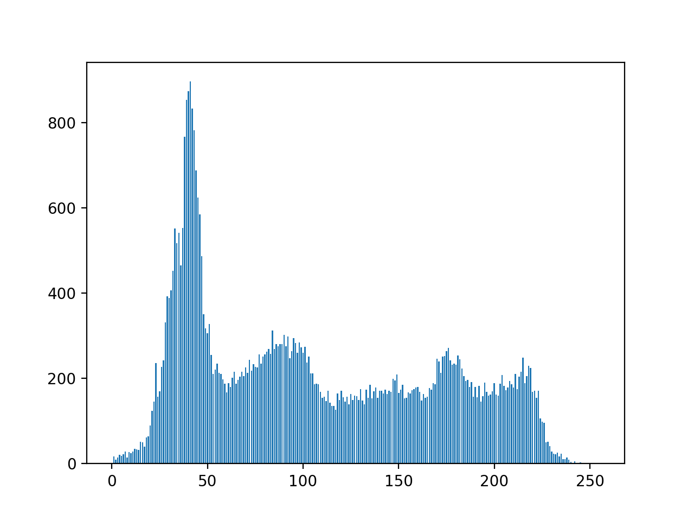

# Traitement d'images en C++

# Séance 1

Dans ce TP nous traiterons uniquement des images en niveaux de gris.
Le format PGM binaire sera utilisé pour la lecture et l'écriture des images.

## Outils

- Le logiciel [ImageJ](https://imagej.nih.gov/ij/download.html), installable en local, est recommandé pour la visualisation des images. 
Il lit notamment les formats PGM et PPM.
- La commande `convert` de ImageMagick (disponible sous Linux et Mac) permet de convertir tout type d'images au format PGM et PPM :
```sh
convert input.jpg input.pgm
```

## Consignes

- Les fichiers initiaux des TP se trouvent dans le répertoire `/base`.
- Pour chaque programme, modifier le `Makefile` pour ajouter un nouvel exécutable.

## Prise en main

- Compiler et tester le programme `main.cpp`
- En vous appuyant sur les méthodes de la classe `Image` , écrire un programme `print_info` qui affiche les informations suivantes sur une image passée en paramètre :
	- dx, dy : (largeur, hauteur)
	- nombre de pixels
	- valeur minimale et valeur maximale des pixels
	- somme des valeurs des pixels
	- niveau de gris moyen
- Écrire un programme qui
	- prend en paramètres deux entiers `dx`, `dy`
	- déclare une image de taille `dx` $`\times`$ `dy` 
	- affecte à chaque pixel de l'image la valeur de son *offset*, c'est-à-dire sa position dans le tableau 1D qui stocke les pixels
	- affiche sur la sortie standard l'image correspondante (utiliser la méthode `Image.print()`)


## Transformations des intensités d'une image

Écrire les programmes suivants.

### Seuillage 

Image originale |      Image seuillée (t=110)
:--------------:|:-----------------:
|

Description :
- `threshold`: Effectue le seuillage d'une image à niveaux de gris.

Paramètres :
- Nom de fichier de l'image d'entrée
- Nom de fichier de l'image de sortie
- Valeur de seuil

Retour :
- Écriture sur le disque de l'image seuillée

Exemple :

```sh
threshold input.pgm output.pgm 110
```


### Négatif

Image originale |      Négatif
:--------------:|:-----------------:
|


Description : 
- `negate` : Calcule le négatif d'une image en niveaux de gris.

Paramètres :
- Nom de fichier de l'image d'entrée
- Nom de fichier de l'image de sortie

Retour :
- Écriture de l'image du négatif


Exemple :

```sh
negate input.pgm output.pgm
```


### Histogramme 
Description :

- `compute_histo` : Calcule l'histogramme d'une image en niveaux de gris codée sur 8 bits.

Paramètres :
- Nom de fichier de l'image d'entrée

Retour :
- Affichage sur la sortie standard de l'histogramme

Exemple :

```sh
compute_histo input.pgm 
0 0
1 0
2 3
3 17
4 2
5 7
...
255 0
```

Utiliser le script `plotHisto.py` pour obtenir une représentation graphique de l'histogramme.

Exemple :
```sh
compute_histo input.pgm | ../plotHisto.py
```


Image  | 
:--------------:|:-----------------:
Histogramme |    


### Étirement de contraste

Image originale |      
:--------------:|:-----------------:
 Étirement de contraste (min=0, max=255) |


Description :
- `normalize` : Effectue l'étirement de contraste d'une image en niveau de gris entre les valeurs *min* et *max* passées en paramètre.

Paramètres :
- Nom de fichier de l'image d'entrée 
- Nom de fichier de l'image de sortie
- Min 
- Max 

Retour :
- Écriture de l'image résultat

Exemple :

```sh
normalize input.pgm output.pgm 0 255
```

Afficher l'histogramme avant et après étirement de contraste.

### Égalisation d'histogramme

Image originale |   
:--------------:|:-----------------:
Égalisation d'histogramme | 


Description :
- Effectue l'égalisation d'histogramme d'une image en niveaux de gris 

Paramètres :
- Nom de fichier de l'image d'entrée
- Nom de fichier de l'image de sortie

Retour :
- Écriture de l'image résultat

```sh
equalize input.pgm output.pgm
```
Afficher l'histogramme avant et après égalisation de l'histogramme.


## Annexe 1 : notions de base en C++

### Structure d'un programme
- similaire au C : fichiers .h et .cpp
- les classes et fonctions définies dans un fichier foo.cpp sont déclarées dans un fichier foo.h (c'est une bonne pratique)

### Classes génériques (ou templates)
- elles sont paramétrées par un type
- elles sont séparées en général en deux fichiers : un fichier .h qui contient leur déclaration, et un fichier .hpp qui contient leur définition
- **les classes templates ne sont pas compilées**, elles sont uniquement incluses dans le fichier source .cpp qui les utilise.
- Exemple: 
	- la classe `Image` est paramétrée par un type, le type des valeurs de ses pixels
	- le fichier `main.cpp` inclut le fichier `image.h` 

### Compilation
- les fichiers .cpp sont compilés en fichiers objets .o
- les fichiers objets sont liés pour construire l'exécutable
- la compilation séparée (qui s'appuie généralement sur un Makefile) permet de recompiler uniquement les fichiers nécessaires
- le fichier `main.cpp` se compile de la manière suivante :

```sh
g++ main.cpp -o TP1
```
### Documentation
- http://www.cplusplus.com
- http://en.cppreference.com/w/

### Notions de base
#### Espaces de nom :
```cpp
namespace foo {
	class A {}
	...
}
```
Accès par :

```cpp
foo::A myClass;
``` 
ou

```cpp
using namespace foo; 
A myClass;
```

#### Librairie standard
Namespace `std`

Exemple, fonction d'affichage sur la sortie standard :

```cpp
std::cout << "Hello world !\n";
```

#### Flux (stream)
- un flux est une abstraction qui transforme une variable ou un objet en une séquence d'octets et vice-versa
- l'opérateur `<<` transforme des objets en séquence d'octets. Exemple, la fonction d'affichage sur la sortie standard :
	
```cpp
std::cout << "Hello world !\n";
```
transforme la chaîne de caractères `"Hello world !\n"` en une séquence d'octets envoyés sur la sortie standard (équivalent du `printf` en C).

- Autre exemple :

```cpp
int i=42; double j=3.14;
std::cout << "i= " << i << " j= " << j << "\n";
```
concatène la chaîne `"i= "`, le contenu de la variable entière `i`, la chaîne `" j= "`, le contenu de la variable `j` de type `double`, le caractère `"\n"` et envoie le tout sous forme de séquence d'octets à la sortie standard

- l'opérateur `>>` transforme une séquence d'octets en objets ou variables. Exemple, la fonction de saisie (équivalent du `scanf` en C) :

	```cpp
	int x; double y;
	std::cin >> x >> y;
	```
	transforme la séquence d'octets de l'entrée standard (caractères saisis par l'utilisateur) en une variable de type `int ` et une variable de type `double`.
- la notion de flux est générique, elle peut désigner aussi bien l'entrée ou la sortie standard, qu'un fichier, une socket, ou autre...


#### Portée des variables 

- variable locale (ou automatique) :

```cpp
A myClass(...);
```
`myClass` est détruit (et son destructeur est appelé) à la fin du bloc courant.

- pointeur :

```cpp
A *myClass=new myClass(...);
```
`myClass` est une variable pointeur (c'est-à-dire une adresse) qui pointe sur une zone mémoire allouée. Cette zone mémoire survit au bloc courant, mais pas la variable pointeur. 
La destruction de la zone mémoire ne peut se faire qu'avec un `delete`

- variable globale : déclarée en dehors de toute fonction, sa portée est l'unité de compilation (le fichier courant...).


## Annexe 2 : lire et écrire dans un fichier en C++

- http://www.cplusplus.com/doc/tutorial/files/
- `std::ifstream` et `std::ofstream` pour ouvrir un fichier en lecture, en écriture
- `std::string` : type de base pour les string en C++
- `std::getline(file,line)` : récupère dans la string line la ligne suivante du fichier file
- `std::stringstream sstr(line)` : construit un flux à partir d'une variable de type `string` (le flux contient la séquence d'octets contenue dans la chaîne de caractères)
- `sstr >> x >> y` : convertit les octets du flux en deux entiers `x` et `y`
- méthodes `read()` et `write()` des classes `std::ifstream`, `std::ofstream`, `std::fstream` pour lire ou écrire des données binaires non structurées (séquence d'octets)


