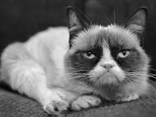
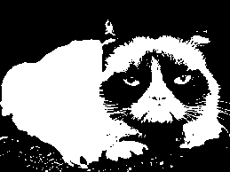

# Traitement d'images en C++

# Séance 2

## Seuillage automatique

### Algorithme d'Otsu

#### Introduction

L'algorithme d'Otsu permet de calculer un seuil de manière automatique dans le contexte d'une segmentation binaire (séparation en deux classes) aussi appelée *binarisation* d'image.

Soit une image $`f:E \rightarrow V`$ et un seuil $`s`$. On considère les deux classes suivantes :

- l'ensemble des pixels qui ont une valeur supérieure au seuil, ou *points objet*, ou encore *foreground*, en anglais, soit $`X_{fg}=\{p \in E \mid f(p)\geq s) \}`$
- l'ensemble des pixels qui ont une valeur inférieure au seuil ou *points fond*, ou *background*, soit $`X_{bg}=\{p \in E \mid f(p) < s) \}`$.

Image originale |      Image seuillée (s=110)
:--------------:|:-----------------:
|

En blanc : les points de $`X_{fg}`$, en noir : ceux de $`X_{bg}`$.

Une mesure possible de l'homogénéité d'un ensemble de valeurs (les intensités des pixels d'une image par exemple) est la *variance* définie (comme d'habitude !) comme l'écart quadratique moyen à la moyenne des valeurs considérées. Ici, par exemple, la variance des intensités de l'image $`f`$ est 

```math
\sigma^2 =\frac{1}{N}\sum_{x\in E} (f(x)-\mu)^2,
```
où $`N`$ est le nombre de pixels de l'image et $`\mu`$ est la valeur moyenne de l'intensité. 
La variance est d'autant plus faible que l'intensité des pixels de l'image est homogène, c'est-à-dire peu éloignée de la moyenne (le cas d'une variance nulle correspondant à une intensité constante).
Noter que cette définition ne diffère pas de celle de la variance d'une variable aléatoire : on considère simplement l'intensité d'un pixel comme une variable aléatoire (à valeur entière comprise entre 0 et 255) dont la distribution est donnée par l'histogramme de l'image.

Si l'ensemble des points est séparé en deux classes (*foreground* et *background*), on peut calculer l'effectif $`N_C`$ de chaque classe $`C`$, ainsi que la moyenne des intensités pour chaque classe
```math
\mu_C=\frac{1}{N_C}\sum_{x\in C}f(x),
```
et bien sûr la variance interne à chaque classe. 
Dans le cas qui nous intéresse ici on obtient donc les deux variances

```math
\sigma^2_{fg}=\frac{1}{N_{fg}}\sum_{x\in X_{fg}}(f(x)-\mu_{fg})^2 
```
et

```math
\sigma^2_{bg}=\frac{1}{N_{bg}}\sum_{x\in X_{bg}}(f(x)-\mu_{bg})^2
```

À partir de ces variances calculées pour chaque classe, on définit pour l'image totale la *variance intra-classe* (*within class variance*) comme une moyenne des variances internes à chaque classe, pondérée par la proportion des points de l'image appartenant à la classe donnée (formellement $`p_C= N_C/N`$ pour la classe $`C`$): 

```math
\sigma^2_w = p_{bg}\sigma^2_{bg}+p_{fg}\sigma^2_{fg} ,
```
Le *seuil d'Otsu* est la valeur de seuillage qui minimise cette variance intra-classe.

La variance inter-classe (*between class variance*) est définie par la différence entre la variance totale de l'image et la variance intra-classe, autrement dit :

```math
\sigma^2_b=\sigma^2-\sigma^2_w
```
Il est clair que le seuil d'Otsu est également caractérisé par la propriété qu'il maximise cette variance inter-classe. (Intuitivement, maximiser la variance inter-classe revient à choisir un seuil qui maximise la dissimilarité entre les deux classes.) 

Un calcul montre par ailleurs que celle-ci est aussi égale à 

```math
\sigma^2_b=p_{bg}p_{fg}(\mu_{bg}-\mu_{fg})^2.
```
Cette expression est particulièrement intéressante dans l'objectif de déterminer un seuil optimal, en ce qu'elle économise le calcul explicite des variances.

#### Implémentation de l'algorithme 

L'implémentation de l'algorithme d'Otsu peut s'appuyer soit sur la minimisation de la variance intra-classe soit sur la maximisation de la variance inter-classe. On choisira plutôt la seconde formulation qui permet d'éviter le calcul explicite des variances.
On remarquera notamment que'histogramme de l'image contient toute l'information nécessaire au calcul efficace des grandeurs utiles.

L'algorithme se formule donc de la manière suivante :

1. Calcul de l'histogramme
2. Pour tous les seuils `s` possibles :
   1. Mettre à jour $`p_{bg}, p_{fg}, \mu_{bg}, \mu_{fg}`$ en utilisant l'histogramme
   2. Calculer $`\sigma^2_b`$
3. Retourner le seuil $`s`$ qui maximise $`\sigma^2_b`$

#### Programme à réaliser

Description :

- `otsu`: Calcule le résultat du seuillage d'une image à niveaux de gris à partir du seuil optimal déterminé par l'algorithme d'Otsu

Paramètres :

- Nom de fichier de l'image d'entrée
- Nom de fichier de l'image de sortie

Retour :

- Écriture sur la sortie standard du seuil choisi par l'algorithme
- Écriture sur le disque de l'image seuillée par l'algorithme d'Otsu

Exemple :

```sh
otsu input.pgm output.pgm
```


### Algorithme des k-moyennes 

Image originale |      Image seuillée (k=...)
:--------------:|:-----------------:
|

Description :

- `kmeans`: Calcule le seuillage d'une image à niveaux de gris à partir de l'algorithme des k-moyennes

Paramètres :

- Nom de fichier de l'image d'entrée
- Nom de fichier de l'image de sortie
- `k` : nombre de classes

Retour :

- Écriture sur le disque de l'image seuillée par l'algorithme des k-moyennes

Exemple :

```sh
kmeans input.pgm output.pgm 4
```
