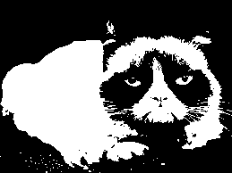
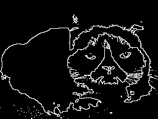
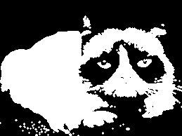
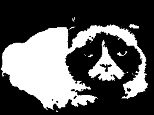
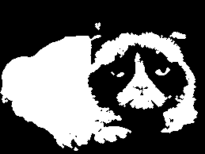
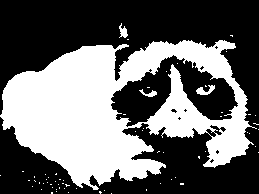

# Traitement d'images en C++

# Séance 3 : Extraction des bords et morphologie mathématique binaire

## Extraction des bords d'une image binaire

Dans une image binaire, le bord d'un objet est l'ensemble des points de l'objet adjacents à au moins un point du fond.
Dans une image 2D on peut considérer deux types d'adjacences : la 4- et la 8-adjacence.

### Programme à réaliser


Image binaire |      Image des bords
:--------------:|:-----------------:
|

Description :

- `extract_border`: Extrait les bords de d'une image binaire selon la 4- ou la 8-adjacence. Les points dont la valeur est différente de `0` sont considérés comme les points de l'objet, les autres (à `0`) étant considérés comme les points du fond.

Paramètres :

- Nom de fichier de l'image d'entrée
- Nom de fichier de l'image de sortie
- Type d'adjacence : `4` ou `8` 

Retour :

- Écriture sur le disque de l'image contenant les bords de l'objet. Les points  du bord prennent la valeur `255`, les autres prennent la valeur  `0`.

Exemple :

```sh
extract_border input.pgm output.pgm 4
```

## Morphologie mathématique binaire

On considère une image binaire $`f`$ et un élément structurant $`B`$
de type boule unitaire (disque de rayon 1). Cet élément structurant peut prendre deux formes selon l'adjacence considérée : la croix pour la 4-adjacence ou le carré pour la 8-adjacence.
Les deux valeurs de l'image sont `0` (noir) et `255` (blanc)
On va implémenter les quatre opérateurs de base de la morphologie mathématique : dilatation, érosion, ouverture,fermeture.


Image binaire |      Dilatation par un disque de rayon 1 (4-adjacence)
:--------------:|:-----------------:
|

Image binaire |      Erosion par un disque de rayon 1 (4-adjacence)
:--------------:|:-----------------:
|


Image binaire |      Ouverture par un disque de rayon 1 (4-adjacence)
:--------------:|:-----------------:
|


Image binaire |      Fermeture par un disque de rayon 1 (4-adjacence)
:--------------:|:-----------------:
|


### Programmes à réaliser 

Ecrire les quatre programmes : 

- `dilate` : dilate une image binaire par un élément structurant de type disque de rayon 1
- `erode` : érode une image binaire par un élément structurant de type disque de rayon 1
- `open` : effectue une ouverture sur une image binaire par un élément structurant de type disque de rayon 1
- `close` : effectue une fermeture sur une image binaire par un élément structurant de type disque de rayon 1


Paramètres :

- Nom de fichier de l'image d'entrée
- Nom de fichier de l'image de sortie
- Type d'adjacence : `4` ou `8`

Retour :

- Écriture sur le disque de l'image résultat.

Exemples :

```sh
dilate input.pgm output.pgm 4
open input.pgm output.pgm 8
```

## Exercices

- A partir de l'image Grumpy en niveaux de gris, effectuer une chaîne de traitements permettant de seuiller automatiquement l'image (par la méthode d'Otsu par exemple), de filtrer l'image pour ne conserver que la silhouette de l'animal puis d'extraire le bord de la silhouette

- Ecrire un script bash permettant d'effectuer les opérations précédentes à partir d'une image en niveaux de gris dont le nom est passé en paramètre

