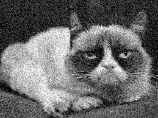

# Compte rendu P4Y


Le but de ce TP était de concevoir, verifier et comparer 2 système de bruitage ainsi 
different algorithme pour les debruiter.

## Modélisation du bruit

### Bruit impulsionnel

Le bruit impulsionnel est assez basique car il consiste à changé les pixel en noir ou blanc sur un certain pourcentage de l'image.
Ce pourcentage est donné en parametre. On peut lancer la fonction de la maniere suivante.

```c++
./bruitImpulsionnel <input.pgm> <output.pgm> <n>
```
 où n est le pourcentage de pixel de l'image à bruiter.

### Bruit gaussien

Le bruit gaussien va plus ou moins aleterer l'image en ajoutant une valeur au pixel. La valeur ajouté est aléatoire 
et est répartie celon la loi normal uniform. On peut lancer la fonction de la manière suivante.

```c++
./bruitGaussien <input.pgm> <output.pgm> <n>
```
où n est sigma, l'ecart type de la loi uniform.


## Filtre median

Le filtre median permet de débruiter une image. Il va prendre tous les pixel autour du pixel a traiter. Il va ensuite trié
ces pixel pour prendre la valeur du pixel medien. De cette manière les pic de couleur seront donc enlever et remplacer par une couleur plus homogene.

```c++
./filtreMedian <input.pgm> <output.pgm> <n>
```
ou n est la dimension de la fenetre dans laquel seront pris les pixels.


## Mean Square Error

Permet de mesurer la dissimilarité entre deux images f et f' de même dimensions N*M celon la formule suivante
```math
MSE(f,f')=\frac{\sum_{x=0}^{N-1} \sum_{y=0}^{M-1} (f(x,y)-f'(x,y))^2}{NM}
```
Elle s'execute de la maniere suivante

```c++
./MeanSquareError <input.pgm> <input2.pgm>
```

## Comparaison
Une fois toutes les images créée, on peut donc constituer le tableau suivant.


|                    |               |      filtre median|     |   filtre moyenneur  |     |   filtre gaussien   |     |
|--------------------|---------------|:------------------:|:----:|:--------------------:|:----:|:--------------------:|:----:|
|                    |               |      3            | 7   |                  3  | 7   |             1       | 2   |
|grumpyImpuls15      || || | | |
|grumpyImpuls40      |        | || | | |
|grumpyGaus15        |        | || | | |
|grumpyGaus30        |        | || | | |

Nous pouvons maintenant nous servir de la fonction MeanSquareError pour connaitre les effet des different filtre sur une 
image bruité par rapport à l'image initial.


|                    |               |      filtre median|     |   filtre moyenneur  |     |   filtre gaussien   |     |
|--------------------|---------------|:-----------------:|:---:|:-------------------:|:---:|:-------------------:|:---:|
|                    |               |      3            | 7   |                  3  | 7   |             1       | 2   |
|grumpyImpuls15      |    3288,37    |   234,669	     | **214,084** |	694,756 |	449,16|  610,94	 |  439,388
|grumpyImpuls40      |    8380,98    |   1227,52	     | **243,911** |	1741,17	|  1083,03|  1537,23 |	1076,52
|grumpyGaus15        |    222,913    |   227,191	     | **211,152** |	271,212	|  274,433|  270,544 |	262,375
|grumpyGaus30        |    830,216    |   342,565	     | **235,069** |	337,489	|   289,12|  320,2	 |  276,791

Ainsi on peut donc déterminer que celon la mesure du MSE le filtre median de 7 par 7 est plutôt enclain à restituer une image proche de l'origine.
Cependant ce choix de filtre pour le débruitage fait perdre en netteté à l'image et donne un effet aquarel. Le filtre moyenneur et gausien

